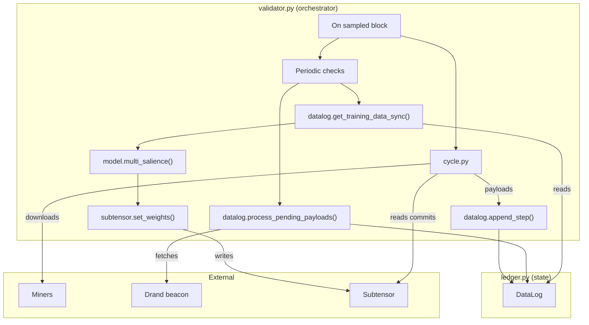

# MANTIS

## Purpose
MANTIS is a Bittensor subnet (netuid 123) that rewards miners for embeddings which help predict the targets specified in config.py, currently these all have a 1 hour horizon and are all financial instruments. Each challenge specifies a ticker, embedding dimension and a block horizon. Validators collect encrypted embeddings, align them with price moves and assign weights based on salience.

---

## Minimal Architecture Diagram


---

## Core Modules
1. **`config.py`** – Defines network constants and the `CHALLENGES` list.
2. **`ledger.py`** – Contains the `DataLog` and per‑challenge `ChallengeData` structures. It stores prices, decrypted embeddings and raw payloads and handles decryption & validation.
3. **`validator.py`** – Orchestrates block sampling, payload collection, decryption, model training and weight setting.
4. **`model.py`** – Computes per‑hotkey salience via per‑hotkey logistic gating, an XGBoost aggregator, and permutation importance.
5. **`cycle.py`** – Downloads miner payloads and validates commit URLs.
6. **`comms.py`** – Performs asynchronous HTTP downloads with caching.
7. **`lbfgs.py`** – Implements the p-only 5-bucket classifier and Q-only path salience (±1σ/±2σ), used for LBFGS challenges.

---

## Data Structure
```python
@dataclass
class ChallengeData:
    dim: int
    blocks_ahead: int
    sidx: Dict[int, Dict[str, Any]]

class DataLog:
    blocks: List[int]
    challenges: Dict[str, ChallengeData]
    raw_payloads: Dict[int, Dict[str, bytes]]
```
Each challenge maps sample indices to prices and hotkey embeddings. The `DataLog` holds the per‑block payload queue and the challenge data.

---

## End‑to‑End Workflow
1. **Initialise** – `validator.py` loads or creates a `DataLog` and syncs the metagraph.
2. **Collect** – Every `SAMPLE_EVERY` blocks the validator downloads encrypted payloads and current prices and appends them via `datalog.append_step`.
3. **Decrypt** – `datalog.process_pending_payloads` obtains Drand signatures once the 300‑block delay has elapsed, decrypts payloads, validates structure and stores embeddings.
4. **Prune** – Periodically, inactive hotkeys are removed from challenge data via `datalog.prune_hotkeys`.
5. **Evaluate** – Every `TASK_INTERVAL` blocks the validator builds training data, computes salience scores and normalises weights on‑chain. A small fixed weight is reserved for young UIDs; the remainder is allocated by salience. For LBFGS challenges, classifier and Q saliences are combined 50/50 within the challenge, then challenge-level weights from `config.py` are applied for multi-challenge aggregation.

6. **Bootstrap** – On first run the validator attempts to download an initial datalog snapshot from `config.DATALOG_ARCHIVE_URL` into `config.STORAGE_DIR`.

---

## Security Highlights
- **Time‑lock encryption** prevents miners from seeing future prices before submitting.
- **Embedded hotkey checks** ensure decrypted payloads belong to the committing miner.
- **Payload validation** replaces malformed data with zero vectors.
- **Download size limits** mitigate denial‑of‑service attacks.

---

## Commit & Payload Constraints
- **Commit host**: Cloudflare R2 only (`*.r2.dev` or `*.r2.cloudflarestorage.com`).
- **Object key**: Path must be exactly your hotkey (no directories or extra segments).
- **Size limit**: Payloads must be ≤ 25 MB.
- **Format**: Only V2 JSON payloads are accepted. They include fields like `v`, `round`, `hk`, `owner_pk`, `C`, `W_owner`, `W_time`, `binding`, and `alg` as described in the payload guide.

---

## Dependencies
Project dependencies are declared in `pyproject.toml` (PEP 621). Key libraries include `bittensor`, `xgboost`, `requests`, `aiohttp`, `torch`, and `scikit-learn`.

See `MINER_GUIDE.md` for setup and `lbfgs_guide.md` for 17-dim LBFGS embeddings.

---

## Extensibility
- Swap out the salience algorithm by editing **`model.py`**.
- Adjust challenges or hyperparameters in **`config.py`**.
- Modify storage or decryption logic in **`ledger.py`**.

---

## License
Released under the MIT License © 2024 MANTIS.

